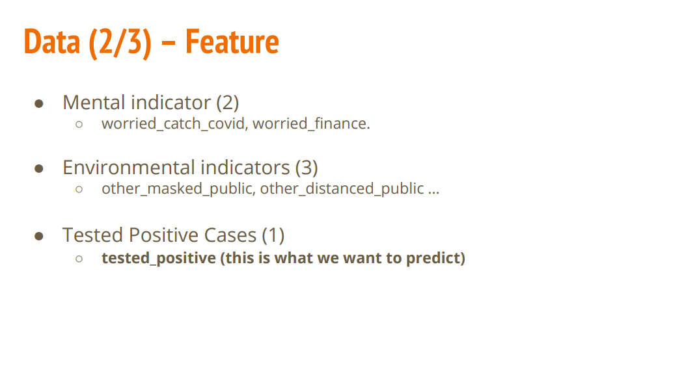
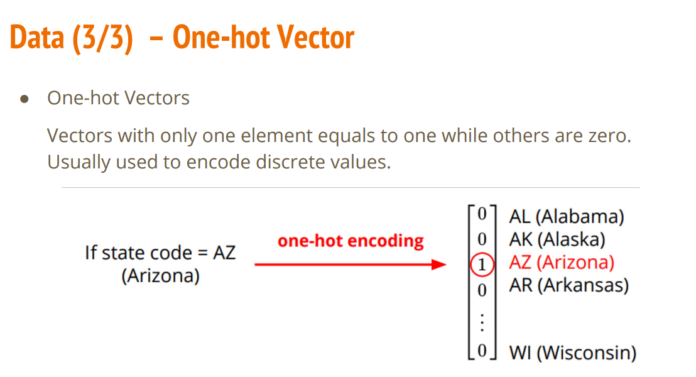
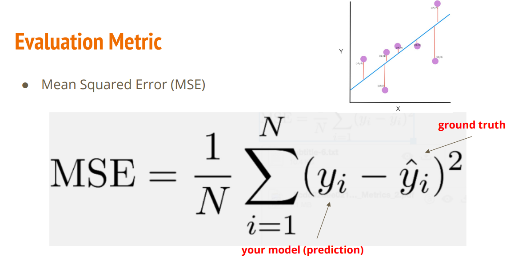

# Data Feature

use these features to predict the 'tested_positive', of course we could use some tricks to improve the performance, like feature selection, feature engineering, etc.
# Evaluateation part
